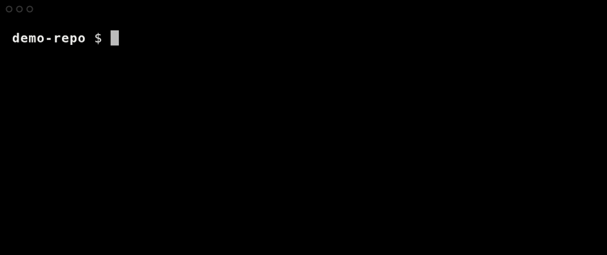

# jj-select

A minimalistic, lightweight TUI utility for [Jujutsu (jj)](https://github.com/martinvonz/jj).

Unlike full-blown TUI clients that take over your entire terminal, `jj-select` is designed to be fast and focused. It reduces mental load by replacing manual ID copy-pasting with interactive selection, using stable, colorful icons to anchor your workflow against the shifting graph layouts of `jj log`.


## 📦 Installation

1. **Prerequisites:** You will need [`gum`](https://github.com/charmbracelet/gum) (default), or [`fzf`](https://github.com/junegunn/fzf), depending on your preferred backend.
2. **Download:** Save the `jj-select` script to a directory in your `$PATH` (e.g., `~/.local/bin/jj-select`).
3. **Make Executable:**
   ```bash
   chmod +x ~/.local/bin/jj-select
   ```
4. **Register the jj Alias:**
   Add it as a native Jujutsu command so you can seamlessly type `jj select`:
   ```bash
   jj config set --user aliases.select '["util", "exec", "--", "jj-select"]'
   ```

## ✨ Visual Anchors

Quickly identify where you are in the graph with stable emojis. *By default, `jj select` grabs your current stack so you don't have to copy 12-character hashes just to edit a commit.*

* 🌿 **Heads:** Mutable heads
* 🪜 **Stack:** Commits in the current stack
* 🪵 **Roots:** Mutable roots
* ☁️ **Remotes:** Remote bookmarks
* 🏷️ **Tags:** Local bookmarks
* ❌ **Conflicts:** Revisions with active conflicts

### Smart Contexts (Modes)


*Filter the noise instantly. Commands like `jj select roots` or `jj select bookmarks` narrow your choices down to exactly what you are looking for. You can even chain actions, like `jj select heads new`, to instantly spawn a child commit.*

### Effortless Rebasing


*Complex graph manipulation becomes a few arrow presses. Use `jj select remotes rebase` to snap your working copy onto `main`, or use `jj select log rebase` to pick up an entire stack and drop it perfectly onto another.*

### Pluggable Backends & Tmux Integration


*`jj-select` natively supports `gum`, `fzf`, and if inside a `tmux` session, `tmux` popups that float right over your active workspace, letting you interact with the graph without losing your terminal context.*

## 🚀 Usage

The syntax is highly flexible. Both the `MODE` and the `COMMAND` are optional.

```text
jj select [MODE] [COMMAND] [OPTIONS] [JJ_FLAGS...]
```

### Common Workflows

```bash
# Edit a commit in your current stack (Defaults: MODE=stack, COMMAND=edit)
jj select

# Create a new child off a specific head
jj select heads new

# Rebase the working copy onto a remote branch
jj select remotes rebase

# Select from the full graph and abandon a commit
jj select log abandon
```

### Advanced Queries & Flags

You can pass standard `jj` flags right through the script, or use the `custom` mode to pass raw revsets.

```bash
# Select from revs touching 'BUILD', then show the diff for that file only
jj select show custom 'files("BUILD")' BUILD

# Select from upstream revs and pass --stat to 'jj show'
jj select show custom "mine() & immutable()" --stat

# Suppress the "Running..." output AND pass --quiet to jj
jj select edit --silent -q
```

### CLI Help Reference

```text
Modes: (Optional, defaults to 'stack')
  stack        Current stack (ancestors/descendants of @)
  heads        All mutable heads
  roots        All mutable roots
  bookmarks    All mutable bookmarks
  remotes      All remote bookmarks
  log          Default graph view (visible revisions)
  custom       Use with a positional argument for revset

Commands: (Optional, defaults to 'edit')
  edit         Switch to the selected revision
  new          Create a child of the selected revision
  rebase       Rebase working copy (@) & descendants onto selection
  duplicate    Create a copy of the selected revision
  abandon      Abandon the selected revision
  restore      Restore files from the selected revision
  evolog       Show the event log for the revision
  show         Show commit details (diff & description)

Options:
  -d, --days <N>           Show revisions from last N days
  -p, --skip-prefix <L>    Skip bookmarks with these prefixes
  -b, --bookmark <NAME>    Pre-select this bookmark
  -t, --tui <BACKEND>      Backend: gum, fzf, gum_tmux, fzf_tmux
                           (tmux backends open in a popup)
  -n, --no-template        Use native jj template instead of TUI
      --dry-run            Print command instead of executing
      --silent             Don't print 'Running: ...' line
  -h, --help               Print help

JJ Flags:
  Any unrecognized options (e.g. -q, --stat) are passed to jj.
```

## ⚙️ Configuration

You can customize `jj-select` entirely through environment variables. Add these to your shell profile (`.bashrc`, `.zshrc`, etc.) to set your defaults:

### Core Settings
| Variable | Default | Description |
| :--- | :--- | :--- |
| `JJ_SELECT_BACKEND` | `gum` | Set the default UI (`gum`, `fzf`, `gum_tmux`, `fzf_tmux`). |
| `JJ_SELECT_SILENT` | `false` | Set to `true` to hide the "Running: jj..." terminal echo. |

### UI & Backend Options
| Variable | Default | Description |
| :--- | :--- | :--- |
| `JJ_SELECT_TMUX_BINARY` (or `TMUX_BINARY`) | `tmux` | The command used to invoke tmux. |
| `JJ_SELECT_TMUX_POPUP_OPTS` | `-w 80% -h 80%` | Adjust the size and styling of the tmux popup window. |
| `JJ_SELECT_FZF_OPTS` | `--height=20%` | Custom visual args passed directly to `fzf`. |

### Visual Anchors (Icons)
| Variable | Default | Description |
| :--- | :--- | :--- |
| `JJ_SELECT_ICON_HEADS` | `🌿` | Override the mutable heads icon. |
| `JJ_SELECT_ICON_STACK` | `🪜 ` | Override the current stack icon. |
| `JJ_SELECT_ICON_ROOTS` | `🪵 ` | Override the mutable roots icon. |
| `JJ_SELECT_ICON_REMOTE` | `☁️ ` | Override the remote bookmarks icon. |
| `JJ_SELECT_ICON_TAG` | `🏷️` | Override the local bookmarks icon. |
| `JJ_SELECT_ICON_CONFLICT` | `❌` | Override the conflict warning icon. |
